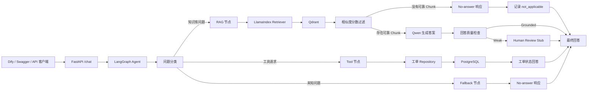
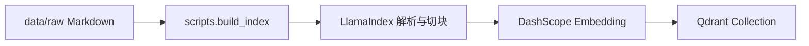
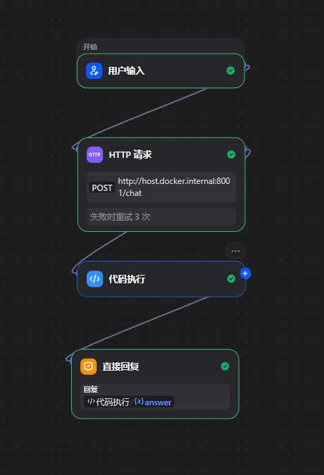
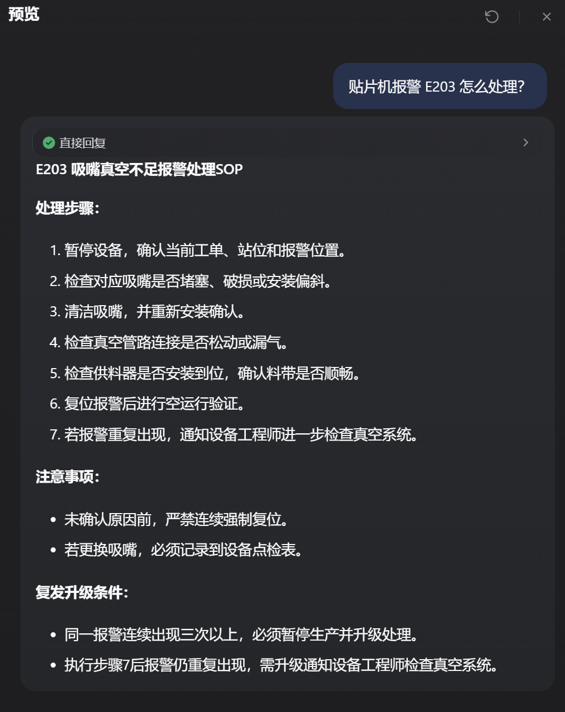
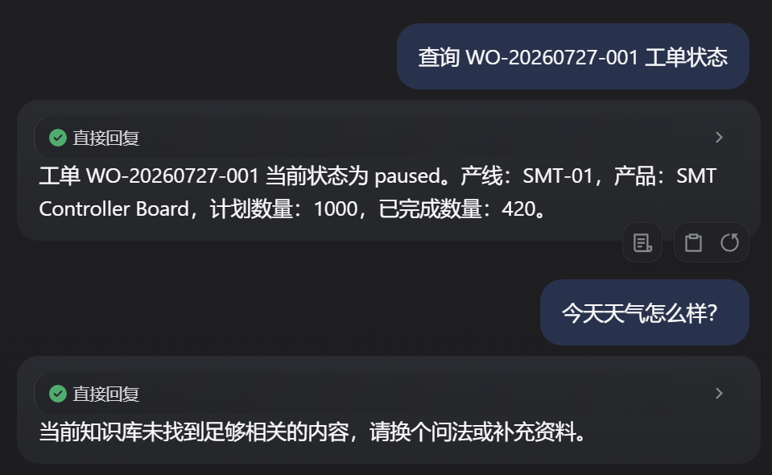

# Manufacturing AI Copilot

Manufacturing AI Copilot 是一个面向制造企业的 AI 助手项目，基于 FastAPI、LangGraph、Qdrant、PostgreSQL 和 Dify 构建。

当前版本支持制造知识库问答、基于 Qdrant 的 RAG 检索、基于 PostgreSQL 的工单状态查询、Fallback 处理，以及 Docker Compose 本地部署。

## 当前能力

- 提供 `/health`、`/search` 和 `/chat` 的 FastAPI 后端
- 基于 Qdrant 检索制造业 Markdown 文档
- 使用 LlamaIndex 完成文档解析、切块、向量化和 Retriever 集成
- 通过 DashScope 调用 Qwen 生成答案
- 使用 LangGraph 编排 Agent 流程
- 支持 RAG、Tool 和 Fallback 三条分支
- 通过 PostgreSQL 查询工单状态
- 实现回答质量检查和 Human Review stub
- 使用 Dify Chatflow 作为可视化演示入口
- 使用 Dockerfile 和 Docker Compose 运行 FastAPI、PostgreSQL 和 Qdrant
- 提供以 Qdrant 为默认后端的检索评估脚本
- 使用 pytest 覆盖单元测试、集成测试和 API 测试

## 系统架构

在线 Agent 问答链路：



离线索引构建链路：



## 技术栈

- Python 3.12
- uv
- FastAPI
- LlamaIndex
- LangGraph
- DashScope / Qwen
- Qdrant
- PostgreSQL
- Dify
- Docker / Docker Compose
- pytest

## 项目结构

```text
src/manufacturing_ai_copilot/  应用源码
scripts/                       命令行与工程脚本
data/raw/                      模拟制造业 Markdown 文档
data/eval/                     检索评估问题集
tests/                         单元测试、集成测试和 API 测试
Dockerfile                     FastAPI 应用镜像定义
docker-compose.yml             FastAPI、PostgreSQL 和 Qdrant 服务编排
.env.example                   可公开的环境变量模板
```

## 环境变量

将 `.env.example` 复制为 `.env`，然后填写本地配置：

```env
DASHSCOPE_API_KEY=replace-with-your-dashscope-api-key
LLM_MODEL=qwen3.7-plus
EMBEDDING_MODEL=qwen3.7-text-embedding
DASHSCOPE_BASE_URL=https://dashscope.aliyuncs.com/compatible-mode/v1
DATABASE_URL=sqlite:///data/manufacturing.db
POSTGRES_DB=manufacturing
POSTGRES_USER=manufacturing
POSTGRES_PASSWORD=replace-with-local-password
QDRANT_URL=http://127.0.0.1:6333
QDRANT_COLLECTION_NAME=manufacturing_knowledge
```

不要提交包含真实密钥和密码的 `.env`。

## 使用 Docker Compose 快速启动

### 1. 准备环境

```powershell
Copy-Item .env.example .env
uv sync
```

在 `.env` 中填写真实的 `DASHSCOPE_API_KEY` 和本地 PostgreSQL 配置。

### 2. 启动数据服务

```powershell
docker compose up -d postgres qdrant
docker compose ps
```

等待 PostgreSQL 和 Qdrant 均显示为 `healthy`。

### 3. 构建 Qdrant 索引

`data/raw/` 不会复制进 FastAPI 镜像，因此索引构建脚本在宿主机执行：

```powershell
uv run --env-file .env python -m scripts.build_index
```

### 4. 构建 API 镜像并初始化 PostgreSQL

```powershell
docker compose build manufacturing-api
docker compose run --rm manufacturing-api uv run python -m scripts.init_database
```

### 5. 启动 FastAPI

```powershell
docker compose up -d manufacturing-api
```

访问：

```text
http://127.0.0.1:8001/health
http://127.0.0.1:8001/docs
```

## 本地开发

保持 Qdrant 在 Docker 中运行，然后初始化本地 SQLite 数据库并启动 FastAPI：

```powershell
docker compose up -d qdrant
uv run --env-file .env python -m scripts.init_database
uv run --env-file .env uvicorn manufacturing_ai_copilot.main:app --host 0.0.0.0 --port 8000 --reload
```

访问：

```text
http://127.0.0.1:8000/health
http://127.0.0.1:8000/docs
```

## 重建 RAG 索引

原始文档、切块配置、Embedding 模型、向量维度或距离算法发生变化时，需要重建 Qdrant Collection：

```powershell
uv run --env-file .env python -m scripts.build_index
```

## API 接口

| Method | Path | 作用 |
| --- | --- | --- |
| GET | `/health` | 检查 FastAPI 服务状态 |
| POST | `/search` | 检索并返回匹配的 Chunk，用于调试召回效果 |
| POST | `/chat` | 执行 Agent 流程并返回最终回答 |

## 问答请求示例

知识库问题：

```json
{
  "question": "贴片机报警 E203 怎么处理？",
  "top_k": 3,
  "department": "生产部"
}
```

Tool 问题：

```json
{
  "question": "查询 WO-20260727-001 工单状态",
  "top_k": 3
}
```

Fallback 问题：

```json
{
  "question": "今天天气怎么样？",
  "top_k": 3
}
```

## 演示场景

| 场景 | Agent 分支 | 外部依赖 | FastAPI 返回 | 当前 Dify 展示 |
| --- | --- | --- | --- | --- |
| E203 报警处理 | RAG | Qdrant + DashScope | `answer`、`sources`、`retrieval` | 仅 `answer` |
| 工单状态查询 | Tool | PostgreSQL | 工单状态答案，`sources=[]` | 仅 `answer` |
| 天气问题 | Fallback | 无业务外部依赖 | 范围提示，`sources=[]` | 仅 `answer` |

当前 Dify 的 Direct Reply 只展示 `answer`。FastAPI 的 RAG 响应还包含 `sources` 和 `retrieval`，后续可以用于实现引用来源界面。

### Dify 演示

Chatflow 编排：



RAG 问答：



Tool 与 Fallback：



## Dify 集成

Dify 独立部署，不包含在本项目的 `docker-compose.yml` 中。Dify 只作为可视化演示入口，RAG、Tool、Fallback 和 LLM 等核心逻辑仍由 FastAPI 后端负责。

推荐 Chatflow：

```text
用户输入
-> HTTP Request
-> Code 节点：解析 JSON 响应 body
-> Direct Reply：展示 answer
```

当 Dify 运行在 Docker Desktop 中时，HTTP Request 节点使用：

```text
POST http://host.docker.internal:8001/chat
```

请求体示例：

```json
{
  "question": "{{user_input}}",
  "top_k": 3
}
```

其中 `{{user_input}}` 仅表示用户问题变量。请通过 Dify 的变量选择器插入开始节点中的用户输入，不要直接照抄该占位符。

Dify 应调用 `/chat`，而不是 `/search`。HTTP Request 节点返回的 `body` 是字符串，因此需要通过 Code 节点解析 JSON，并只向用户暴露所需字段。

本地开发时，需要在 Dify 的 SSRF 策略中明确允许访问 `host.docker.internal`。生产环境中不应直接关闭全部 SSRF 防护。

## 测试

```powershell
uv run pytest
```

## 检索评估

使用 Qdrant 作为检索后端：

```powershell
uv run --env-file .env python -m scripts.evaluate_retrieval
```

## 当前边界

- 问题分类仍使用关键词规则。
- Tool 分支目前只支持工单状态查询。
- 尚未实现 Tool + RAG 混合链路。
- 尚未实现 Rerank、Hybrid Retrieval、增量索引和生产级健康检查。

## 后续规划

- 使用 LLM 完成意图分类
- 实现 Tool + RAG 混合链路
- 通过 Rerank 或 Hybrid Retrieval 提升检索质量
- 增加索引健康检查和增量索引
- 完善生产环境部署文档
