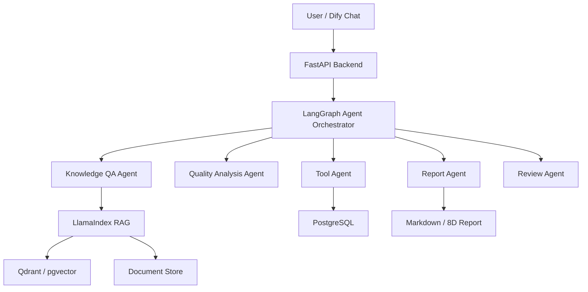

# Manufacturing AI Copilot

Manufacturing AI Copilot 是一个面向制造企业场景的“智能知识库 + 多 Agent 助手系统”。

项目目标不是只做一个简单聊天机器人，而是逐步完成一个能演示、能部署、能面试讲清楚的 AI 应用工程项目。

## 项目目标

做一个制造企业内部 AI Copilot，支持：

- SOP 问答
- 设备报警处理查询
- 质量异常分析
- 8D 报告生成
- MES / IT 系统说明查询
- 多 Agent 流程编排
- 人工确认和结果溯源

## 技术栈

```text
FastAPI         后端接口
LlamaIndex      文档入库、RAG、引用溯源
LangGraph       多 Agent 编排、状态机、人工确认
Dify            可视化 Chat / Workflow 入口
PostgreSQL      业务数据
Qdrant/pgvector 向量库
Docker Compose  工程化部署
```

## 阶段化技术边界

当前阶段目标是先跑通最小 RAG 闭环。

当前阶段必需：

```text
FastAPI
LlamaIndex
本地 Markdown 文档
LlamaIndex 本地持久化索引
```

后续阶段再引入：

```text
LangGraph
Dify
PostgreSQL
Qdrant / pgvector
Docker Compose
```

这样可以先验证主流程，再逐步替换和扩展基础设施。

## 系统架构



## 第一里程碑

先做最小闭环：

```text
用户问题
  -> FastAPI /chat
  -> LlamaIndex 检索本地 Markdown 文档
  -> 返回答案 + 引用来源
```

验收示例：

```text
输入：贴片机报警 E203 怎么处理？

输出：
1. 可能原因
2. 处理步骤
3. 注意事项
4. 来源文档：SMT设备报警处理SOP.md，第几段
```

## `/chat` 返回结构

第一阶段 `/chat` 接口返回结构先固定为：

```json
{
  "answer": "贴片机报警 E203 通常与吸嘴真空不足或送料异常有关...",
  "sources": [
    {
      "document": "SMT设备报警处理SOP.md",
      "section": "E203 报警处理",
      "score": 0.86
    }
  ]
}
```

重点不是只让模型回答，而是返回可追溯的答案。

## 第一周任务

1. 建项目结构
2. 准备 5 份模拟制造业文档
3. 实现文档入库脚本
4. 实现 `/health` 接口
5. 实现 `/chat` 接口
6. 返回带引用的 RAG 答案

## 第一批模拟文档

```text
SMT设备报警处理SOP.md
注塑机日常点检规范.md
MES工单状态说明.md
质量异常8D报告模板.md
员工IT系统使用手册.md
```

## Markdown 文档元数据规范

第一批模拟文档统一使用 front matter：

```markdown
---
doc_id: smt_alarm_sop
title: SMT设备报警处理SOP
department: 生产部
doc_type: SOP
version: v1.0
access_level: internal
---
```

这些字段后续用于权限过滤、来源追踪和企业知识库管理。

## Common Commands

### Install dependencies

```powershell
uv sync
```

### Build local RAG index

```powershell
uv run --env-file .env python -m scripts.build_index
```

### Run FastAPI server

```powershell
uv run --env-file .env uvicorn manufacturing_ai_copilot.main:app --reload
```

### Run tests

```powershell
uv run pytest
```

当前测试结果：

```text
19 passed, 1 warning
```

### Run retrieval evaluation

```powershell
uv run --env-file .env python -m scripts.evaluate_retrieval
```

当前评估结果：

```text
Hit@3: 10/10
Top1 Accuracy: 10/10
No-answer Pass: 2/2
```

## 当前状态

V1 已完成本地 Markdown RAG 闭环：

- FastAPI `/health`、`/search`、`/chat`
- LlamaIndex 本地 `storage`
- DashScope `text-embedding-v3`
- Qwen 生成答案
- Retriever 评估脚本
- pytest 单元测试和 API 层测试

创建日期：2026-07-04
